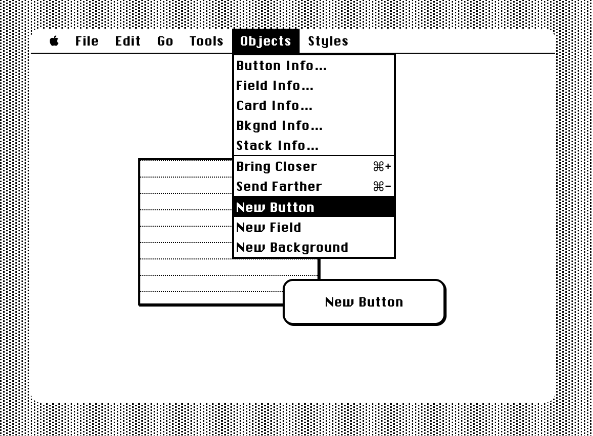

## Cardigan

Building a Hypercard clone with React and Replit.

### What's HyperCard?
[It's all here](https://en.wikipedia.org/wiki/HyperCard). Truly a work of art created by [Bill Atkinson](https://en.wikipedia.org/wiki/Bill_Atkinson) for Apple in the late 80s, with iconography by [Susan Kare](https://en.wikipedia.org/wiki/Susan_Kare).

### What's with the name Cardigan?
A play on words. "Card Again" 😅

### Related projects in the wild
- [hypercardsimulator.com](https://hypercardsimulator.com/)
- [hypercardadventures.com](https://hypercardadventures.com/)